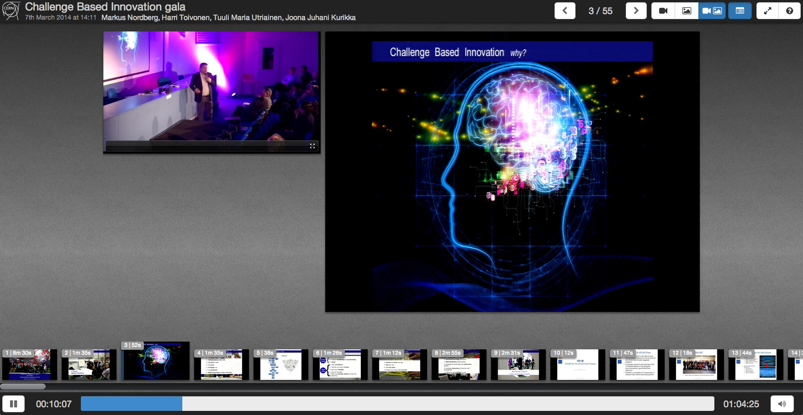

WebLecture Player
===

This web lecture video player lets you simultaneously play 2 videos with slides thumbnails.
At [CERN](www.cern.ch) hundreds of lectures are recorded per year. This web lecture video player is the standard tool to play recorded lectures.

## Screenshots

## Examples

* [CERN Talk: Challenge Based Innovation gala](http://cds.cern.ch/record/1667604)
* [CERN Talk: ATLAS Upgrade Overall](http://cds.cern.ch/record/1670507)
* [CERN Talk: First CMS Pixel Upgrade](http://cds.cern.ch/record/1670319)

## Features

* Web lecture player capable of playing 2 simultaneous videos in-sync (normally speaker video and slides video).
* JWPlayer powered, HTML5 falling back to Adobe Flash depending on the browser.
* Lecture content JSON based.
* Fully featured player with controls for video play/stop, seek, volume slider, slides switcher.
* List of thumbnails following automatically the video. Jump on click to a particular point of the video.
* Auto-resize according to browser dimension.
* Tested on IE (8 or higher), Chrome, Firefox and Safari

## How to prepare a lecture

Create a new folder in your www/ dir (it can be a completely different than the weblecture player code):

* folder_id
    * lecture.json
    * camera.mp4
    * slides.mp4
    * thumbs/

## lecture.json

The JSON object, contained in lecture.json, describes the content of the lecture. It has to be structured like this (unless you change the parsing on lecture_parser.js):

    {
        lecture: {
            chapters: [
                {
                    speakers: [
                        "John Doe",
                        "First Name Last Name"
                    ],
                    begin: 0,
                    duration: 510,
                    fbegin: "00:00:00",
                    fduration: "00:08:30",
                    title: "Chapter 1"
                }
            ],
            date: "2014-03-07",
            duration: 3865,
            fduration: "01:04:25",
            speakers: [
                "John Doe",
                "First Name Last Name"
            ],
            thumbs: [
                {
                    begin: 0,
                    duration: 510,
                    fbegin: "00:00:00",
                    fduration: "00:08:30",
                    src: "thumb1.png"
                },
                {
                    begin: 510,
                    duration: 95,
                    fbegin: "00:08:30",
                    fduration: "00:01:35",
                    src: "thumb2.png"
                },
                {
                    begin: 605,
                    duration: 52,
                    fbegin: "00:10:05",
                    fduration: "00:00:52",
                    src: "thumb3.png"
                },
                ...
            ],
            thumbs_h: 84,
            thumbs_w: 150,
            time: "14:30:00",
            title: "Title of this lecture"
        }
    }

* **chapters**: this is an optional list of chapters.
* **duration** and **fduration**: duration of the lecture is seconds and formatted HH:MM:SS.
* **date** and **time**: lecture happened the YYYY-MM-DD at HH:MM:SS.
* **speakers**: list of speakers of the lecture.
* **thumbs**: this is the list of thumbnails that appears on the bottom of the player.
    * **begin** and **fbegin**: the second of the lecture's duration to enlarge this thumbnail (and formatted version).
    * **duration** and **fduration**: duration of the thumbnail (and formatted version).
    * **src**: image filename.
* **thumbs_h** and **thumbs_w**: size of the thumbnails.
* **title**: title of the lecture.

When the player is loaded, it will try to load the file lecture.json (object above). Then, if success, it will continue initializing the 2 video players.

## How to play a lecture

1. copy js/config.sample.js js/config.js
2. edit js/config.js, change it according to your configuration (comments are self-explanatory)
3. compile the dev or prod version
    * grunt dev or grunt prod
    * project files are ready in dist/ folder
4. open your browser, visit yourdomain.ext/weblectureplayer/dist/index.html?lecture=folder_id (and any other extra param here)

If you are using **different domains** for the weblecture player code and lectures folders, be sure that you allow JS/AJAX to fetch the lecture.json. On your web server, add this:

* Access-Control-Allow-Origin: *.yourdomain.com
* Access-Control-Allow-Methods: GET
* Access-Control-Allow-Headers: Authorization

Plus, add and set the file **crossdomain.xml** (required by Flash).

## Dev

If you want to contribute to the project, you can find all the source code in **src** folder.
To develop, cd to the root folder of the project, then use [Grunt](http://gruntjs.com/).

    grunt dev

a dev version of the project will be compiled in the **dist/** folder.

### SOFTWARE INCLUDED AND LICENSES

The player is released with GPLv3 license and comes with:

* [jQuery](https://jquery.org/license/) and a couple of plugins, MIT License:
    + [Tiny Scrollbar](http://baijs.nl/tinyscrollbar/) customized.
    + [jQuery debounce](http://benalman.com/projects/jquery-throttle-debounce-plugin/).
* [Bootstrap](http://getbootstrap.com) and a couple of plugins, Apache 2 License:
    + [Slider for Bootstrap](http://www.eyecon.ro/bootstrap-slider/) customized.
    + [Bootstrap Tour](http://bootstraptour.com/).
* [JWPlayer 5.10](http://developer.longtailvideo.com) free version, [CC License](http://creativecommons.org/licenses/by-nc-sa/3.
0/), customized to expose some APIs.
* [Font Awesome](http://fortawesome.github.io/Font-Awesome/license/), GPL compatible License.
